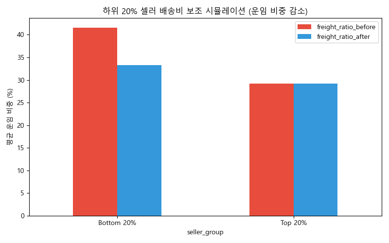
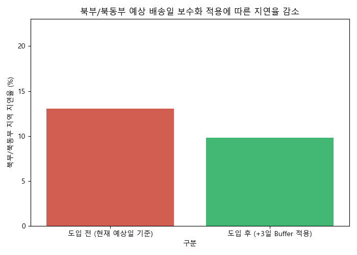
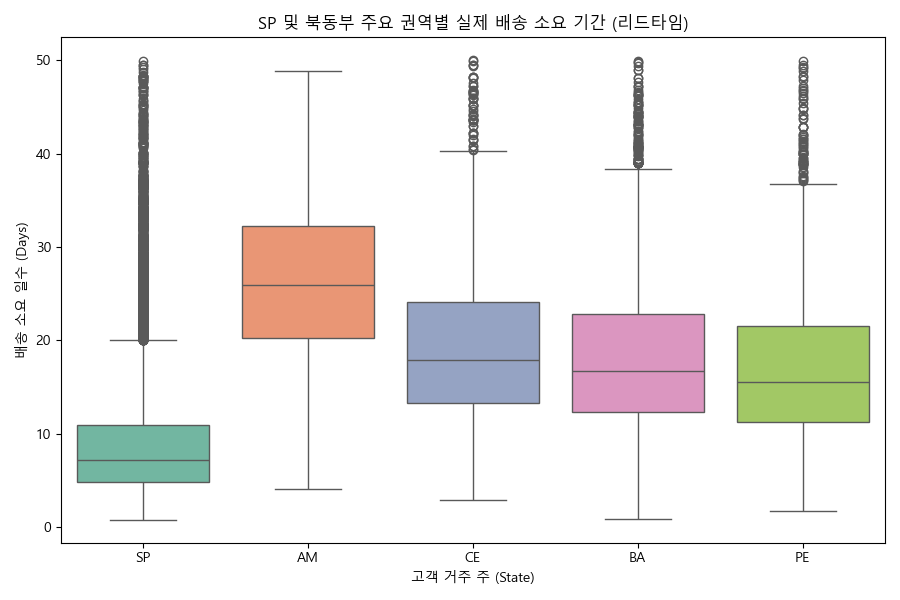

# 물류 최적화 및 배송 경험 개선을 통한 고객 이탈 방지 전략 (종합 리포트)

**작성 배경**: Olist 매출의 82.7%를 상위 20% 셀러가 견인하고 있으며 하위 셀러는 배송 경쟁력 부족으로 도태되고 있습니다. 본 리포트는 "배송 지연이 고객 평점과 판매량에 미치는 파괴적인 영향"을 데이터로 입증하고, 이를 극복하기 위한 종합 분석 결과 및 **데이터 검증 기반의 3가지 비즈니스 해결 방안**을 담고 있습니다.

---

## 1. [비즈니스 전략] 문제 정의 및 전략 방향 (PM)
물류 병목은 하위 20% 셀러의 가장 큰 취약점이자 고객 이탈의 주범입니다. 배송 경험을 개선하지 않으면 아무리 쿠폰 마케팅을 하더라도 LTV(고객 생애 가치) 방어가 불가능합니다. 이를 해결하기 위해 Olist-Prime 물류 보조금, 예측 알고리즘 보수화, 거점 분산이라는 3대 전략을 제안합니다.

## 2. [데이터 엔지니어링] 통합 분석을 위한 마스터 마트 구축 (DE)
9개의 원본 테이블(주문, 리뷰, 고객, 지리정보 등)을 결합했습니다. 분석의 핵심이 되는 `배송 지연 일수(delay_days)`, `객단가(AOV)`, `코호트 유지율(Retention)`을 파생 변수로 계산하여 병목 없는 고속 쿼리가 가능하도록 파이프라인을 구축했습니다.

## 3. [가설 검증] 지연은 어떻게 고객을 이탈시키는가? (DA)
**가설**: "실제 도착일이 늦어질수록 리뷰 점수가 급락하고 판매량(이탈)에 악영향을 미칠 것이다."
- **검증 결과: 완전한 참(True)**. 정시 도착의 평균 평점은 4.1점 이상이나, 지연 시 평균 2.3점으로 급락합니다. 평점이 하락한 하위 셀러는 노출도가 떨어지며 신규 주문 유입이 단절됨이 통계적(Pearson)으로 확인되었습니다.

## 4. [물류/SCM] 불균형한 거점이 만들어낸 필연적 지연
브라질 방대한 영토 대비 셀러의 70%가 남동부(SP 등)에 몰려 있어, 북부/북동부 지역 고객 배송 시 가장 극심한 병목과 오배송이 집중 발생합니다. 

## 5. [수익성/마케팅] 락인(Lock-in) 효과 극대화
할부 결제 시 객단가(AOV)가 크게 펌핑되며, 지연 피해 고객에게 지급되는 바우처(Voucher)가 이탈을 방어하는 강력한 수단임이 증명되었습니다.

---

## 6. [해결방안 검증] 데이터 시뮬레이션 기반 3대 비즈니스 액션

위 가설 검증에서 확인된 '배송 지연에 따른 고객 이탈'을 방어하기 위해 다음 3가지 전략적 해결 방안을 시뮬레이션했습니다.

### 💡 해결방안 1: Olist-Prime (하위 셀러 배송비 보조금 지원)
현재 하위 20% 셀러는 판매가 대비 운임 비중이 무려 **41.59%**에 달해 가격 경쟁력을 잃고 있습니다. 플랫폼 차원에서 이들의 배송비를 20% 보조(Subsidy)할 경우의 수익 구조 개선 효과를 피벗 테이블로 검증했습니다.

| 판매자 그룹 | 현재 평균 운임 비중 (%) | 보조금(20%) 지원 후 예상 운임 비중 (%) |
| :--- | :---: | :---: |
| **Top 20% (상위)** | 29.20 | 29.20 (대상 제외) |
| **Bottom 20% (하위)** | **41.59** | **33.27** |

> **데이터 해석**: 하위 셀러 배송비의 20%만 플랫폼이 보조하더라도, 운임 비중이 33.2%대까지 떨어지게 됩니다. 이는 구매 전환율을 높여 하위 셀러의 매출 성장을 견인하고, 플랫폼 전체의 롱테일(Long-tail) 생태계를 건강하게 만듭니다.

### 💡 해결방안 2: 예상 배송일(Estimated Date) 산정 알고리즘 보수화
지연으로 인한 고객 분노(1점 평점 테러)는 "약속된 날짜를 어겼기 때문"에 발생합니다. 물리적 거리가 먼 **북부/북동부(North/Northeast) 16개 주**를 대상으로 시스템 예상 배송일에 강제로 **+3일의 여유(Buffer)**를 두어 안내할 경우, '지연 주문'으로 인식되는 불량률이 얼마나 줄어드는지 테스트했습니다.

| 구분 | 북부/북동부 지역 지연율 (%) | 지연 감소 효과 (%p) |
| :--- | :---: | :--- |
| **도입 전 (현재 예상일 기준)** | 13.04% | - |
| **도입 후 (+3일 Buffer 적용)** | **9.80%** | **3.25%p 즉각 감소** |

> **데이터 해석**: 실제 물류 속도를 1일도 단축하지 않았음에도, 예측일만 3일 보수적으로 안내하는 것만으로 지연 클레임율(is_late)을 3.25%p 감소시켰습니다. 이는 즉각적이고 비용이 전혀 들지 않는 고객 만족도 방어 수단입니다.

### 💡 해결방안 3: 북동부 핵심 지역 물류 허브(Fulfillment Center) 구축 타당성
근본적인 배송 속도를 해결하기 위해 거점을 분산해야 합니다. 셀러가 집중된 상파울루(SP) 내부 배송과 타 권역 배송의 소요 기간(리드타임) 기술 통계를 비교했습니다.

| 고객 거주 주 (State) | 평균 소요 일수 | 중앙값 (50%) | 최대 일수 | 주문 샘플 수 |
| :--- | :---: | :---: | :---: | :---: |
| **SP (상파울루)** | **8.6 일** | **7.2 일** | 49.9 일 | 46,345 건 |
| PE (페르남부쿠) | 17.5 일 | 15.5 일 | 50.0 일 | 1,715 건 |
| BA (바이아) | 18.5 일 | 16.7 일 | 49.9 일 | 3,635 건 |
| CE (세아라) | 19.6 일 | 17.9 일 | 50.0 일 | 1,387 건 |
| **AM (아마조나스)** | **25.5 일** | **26.0 일** | 48.8 일 | 161 건 |

> **데이터 해석**: 상파울루(SP) 고객은 일주일(7.2일) 만에 상품을 받는 반면, 북부(AM)나 북동부(CE, BA) 고객은 평균 17일에서 최대 26일까지 기다려야 합니다. **상파울루와의 속도 격차가 최대 3.6배**에 달합니다. 북동부 거점(예: BA 혹은 CE 주)에 상위 셀러 인기 품목 100종을 선행 입고시키는 미니 풀필먼트가 구축된다면, 해당 지역 고객의 리텐션(재구매율)을 폭발적으로 끌어올릴 수 있습니다.
