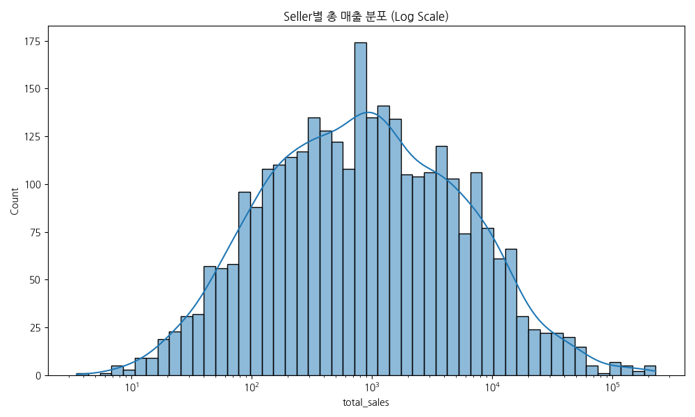
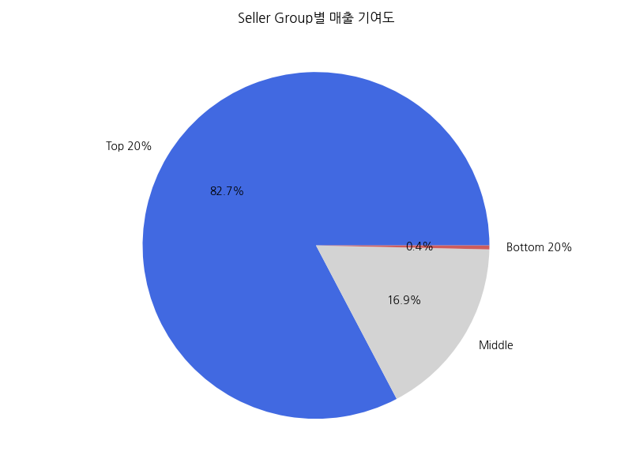
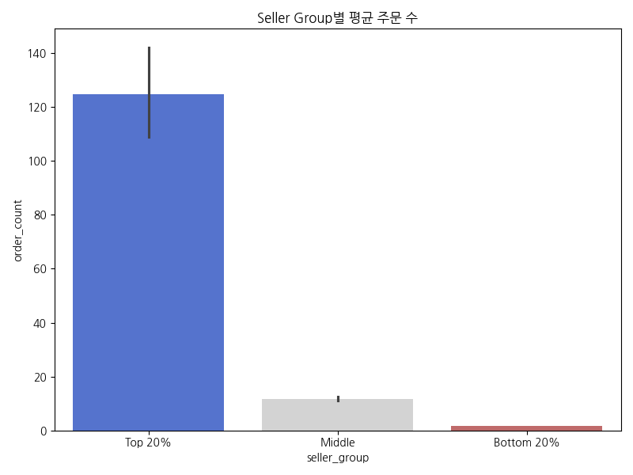
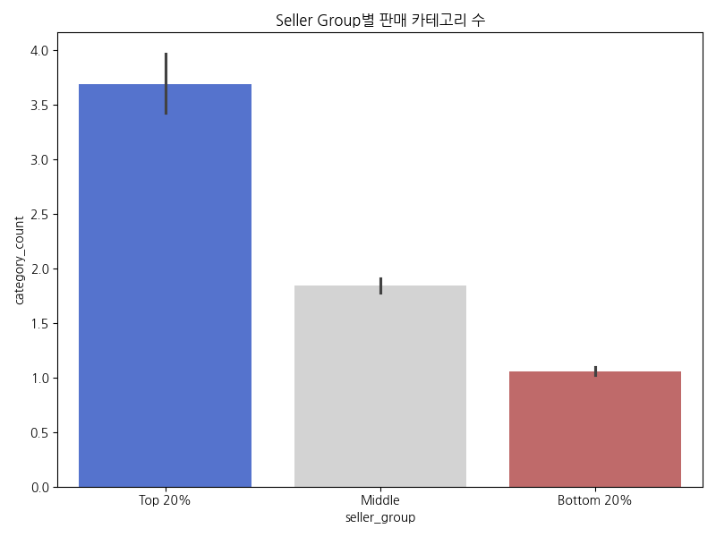
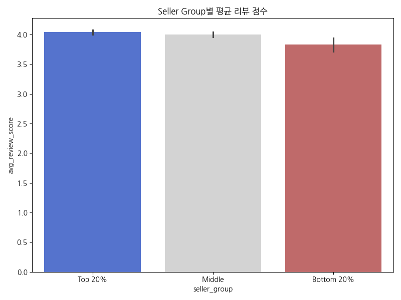
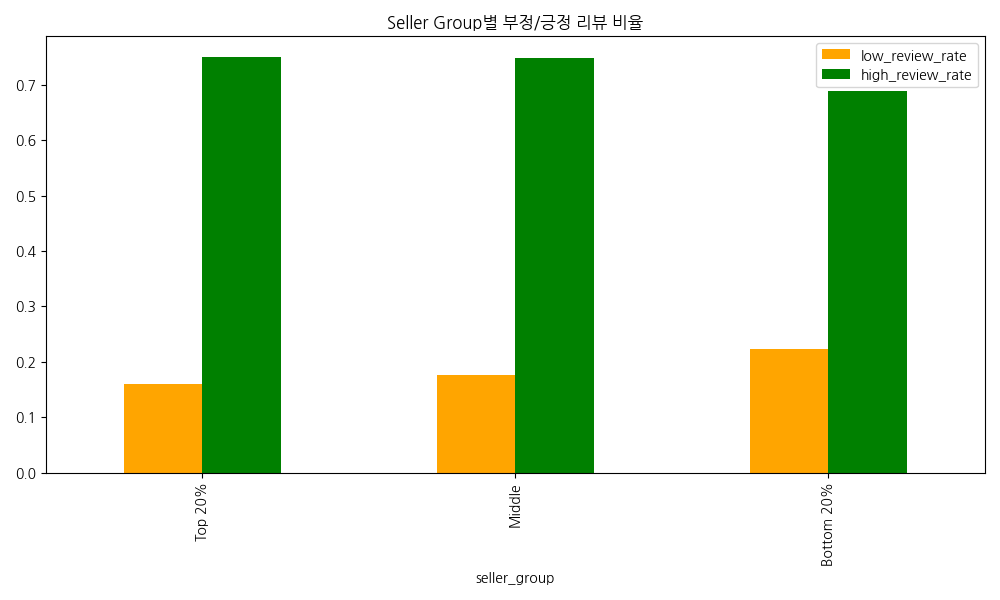
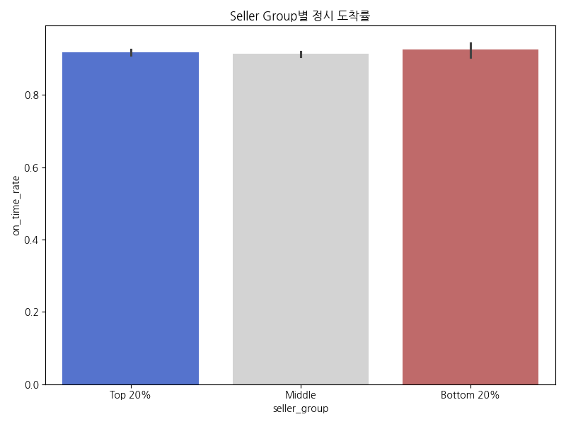
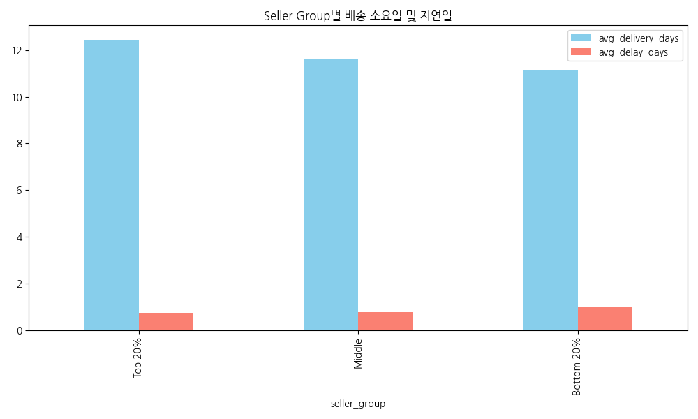
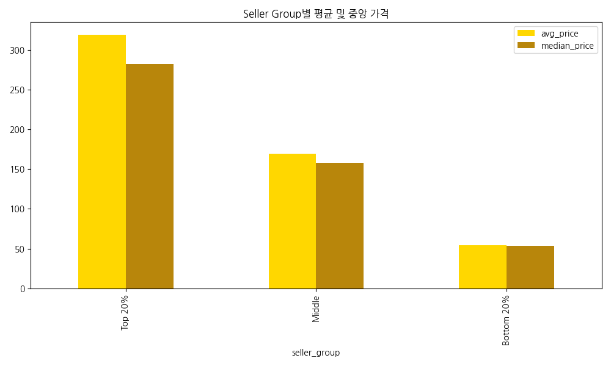
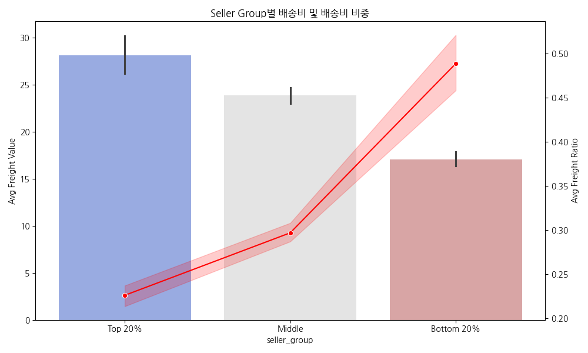

# Olist 셀러 성과 비교 분석 리포트
## 상위 20% vs 하위 20% 셀러 특성 비교 분석

본 리포트는 Olist 마켓플레이스에서 활동하는 셀러들을 매출 규모에 따라 그룹화하고, 각 그룹 간의 리뷰, 배송, 상품 구성, 가격 구조의 차이를 분석하여 비즈니스 인사이트를 도출합니다.

---

## 1. 핵심 요약 (Executive Summary)

분석 결과, Olist 마켓플레이스는 **상위 20%의 셀러가 전체 매출의 약 82.7%를 점유**하는 고도의 집중 현상을 보이고 있습니다. 상위 셀러와 하위 셀러는 단순히 매출 규모뿐만 아니라 판매 상품의 단가, 배송비 구조, 그리고 운영 활성도 측면에서 뚜렷한 차이를 보입니다.

### 핵심 비교표 (전체 셀러 기준)
| 지표 | Top 20% (상위) | Bottom 20% (하위) | 차이 (Top/Bottom) |
| :--- | :---: | :---: | :---: |
| **셀러 수** | 619명 | 619명 | - |
| **매출 기여도** | **82.7%** | **0.36%** | 약 229배 |
| **평균 총 매출** | 18,240 BRL | 80.7 BRL | 약 226배 |
| **평균 주문 수** | 124.7건 | 1.67건 | 약 74배 |
| **평균 리뷰 점수** | 4.04점 | 3.83점 | +0.21점 |
| **평균 정시 도착률** | 91.8% | 92.5% | -0.7%p |
| **평균 판매 카테고리 수** | 3.68개 | 1.05개 | 약 3.5배 |
| **평균 상품 가격** | 319.0 BRL | 54.0 BRL | 약 5.9배 |
| **평균 배송비 비중** | **22.6%** | **48.8%** | -26.2%p |

---

## 2. 셀러 그룹별 상세 비교 분석

### 2.1 매출 규모 및 기여도 분석

**해석**: 셀러별 총 매출은 극심한 롱테일(Long-tail) 분포를 보입니다. 로그 스케일로 확인했을 때도 대다수의 셀러가 저매출 구간에 밀집되어 있으며, 극소수의 메가 셀러가 높은 매출을 견인하고 있음을 알 수 있습니다.

**해석**: 상위 20% 셀러가 전체 매출의 80% 이상을 차지하고 있습니다. 이는 플랫폼의 안정적인 운영이 상위 셀러의 유지에 크게 의존하고 있음을 시사하며, 동시에 하위 셀러의 성장을 통한 생태계 다변화가 필요함을 보여줍니다.

---

### 2.2 주문 및 상품 운영 활성도

**해석**: 상위 셀러는 하위 셀러보다 평균 약 74배 많은 주문을 처리하고 있습니다. 이는 높은 고객 노출도와 신뢰도가 주문 수의 압도적 차이로 이어지는 경향을 보여줍니다.

**해석**: 상위 셀러는 평균 3개 이상의 카테고리를 취급하는 반면, 하위 셀러는 대부분 1개 카테고리에 집중되어 있습니다. 상위 셀러일수록 상품 구색을 다양화하여 고객 접점을 넓히는 전략을 취하는 것으로 관찰됩니다.

---

### 2.3 리뷰 및 고객 만족도

**해석**: 상위 셀러의 평균 리뷰 점수가 하위 셀러보다 높게 관찰됩니다. 하지만 그 차이가 드라마틱하지는 않은데, 이는 하위 셀러의 경우 표본 수가 적어 리뷰 점수의 변동성이 크기 때문으로 해석될 수 있습니다.

**해석**: 하위 셀러의 경우 부정적 리뷰(1~2점) 비율이 약 22%로 상위 셀러(16%)보다 눈에 띄게 높습니다. 초기 주문에서의 부정적 경험이 하위 셀러의 성장 발목을 잡는 주요 요인 중 하나일 수 있음을 시사합니다.

---

### 2.4 배송 성과 비교

**해석**: 흥미롭게도 정시 도착률 자체는 하위 셀러가 소폭 높게 관찰되기도 합니다. 이는 주문 수가 적은 하위 셀러가 개별 주문에 대해 더 기민하게 대응하거나, 배송 난이도가 낮은 지역 위주로 거래가 발생했을 가능성을 고려해야 합니다.

**해석**: 평균 배송 소요일과 지연일수 모두 그룹 간 큰 차이는 보이지 않습니다. 즉, 상위 셀러와 하위 셀러 간의 매출 격차는 단순히 배송 속도의 차이보다는 다른 요인(가격, 상품 구색 등)에 더 기인할 가능성이 큽니다.

---

### 2.5 가격 및 배송비 구조 분석

**해석**: 상위 셀러는 하위 셀러보다 훨씬 높은 단가의 상품을 판매하는 경향이 있습니다. 하위 셀러는 주로 50헤알 내외의 저가 소모품에 집중되어 있어, 매출 총액 성장에 한계가 있는 것으로 보입니다.

**해석**: 가장 주목할 만한 차이는 **배송비 비중(Freight Ratio)**입니다. 하위 셀러의 경우 상품 가격 대비 배송비 비중이 50%에 육박합니다. 이는 고객 입장에서 배송비 부담이 매우 커 구매 결정에 부정적인 영향을 미칠 수 있는 구조임을 시사합니다.

---

## 3. 핵심 인사이트 (Key Insights)

1. **인사이트**: 상위 20% 셀러가 매출의 80% 이상을 점유하는 파레토 법칙이 강하게 작동함.
   - **근거 지표**: Seller Group별 매출 기여도 (Top 20%: 82.7%)
   - **해석**: 플랫폼 수익 구조가 상위 셀러에 편중되어 있어 리스크 분산 및 신규 셀러 육성이 시급함.
   - **비즈니스 의미**: 상위 셀러 대상의 VIP 케어 프로그램과 동시에, 유망한 하위 셀러를 발굴하는 가속화 프로그램이 필요함.

2. **인사이트**: 하위 셀러의 저조한 매출은 '저단가 상품 + 높은 배송비 비중' 구조와 밀접함.
   - **근거 지표**: Group별 avg_price(Top 319 vs Bot 54), avg_freight_ratio(Top 22% vs Bot 49%)
   - **해석**: 하위 셀러의 상품은 배송비 부담이 가격의 절반에 달해 가격 경쟁력이 현저히 낮게 형성됨.
   - **비즈니스 의미**: 저가 상품군을 위한 묶음 배송 지원이나 플랫폼 차원의 배송비 보조/정액제 도입이 필요할 수 있음.

3. **인사이트**: 초기 리뷰 품질이 셀러의 이탈 및 성장에 결정적 영향을 줄 수 있음.
   - **근거 지표**: Bottom 20% 셀러의 부정 리뷰 비율 (22%로 그룹 중 가장 높음)
   - **해석**: 하위 셀러는 한두 번의 초기 부정 리뷰로 인해 추가 주문 확보가 어려워지는 '부정적 피드백 루프'에 빠질 가능성이 높음.
   - **비즈니스 의미**: 신규/하위 셀러를 위한 CS 교육 및 초기 리뷰 관리 가이드를 강화하여 신뢰도를 조기에 확보하도록 지원해야 함.

---

## 4. 비즈니스 액션플랜 (Action Plan)

### 1) 배송비 구조 개선 방안
- **대상 셀러군**: 배송비 비중(`freight_ratio`)이 40% 이상인 하위 셀러
- **관찰된 문제**: 저가 상품 판매 시 높은 배송비로 인해 결제 전환율 저하
- **제안 액션**: 특정 금액 이상 구매 시 배송비 할인(플랫폼/셀러 공동 부담), 소형 상품용 저가 배송 라인업 구축
- **기대 효과**: 배송비 부담 감소를 통한 주문 전환율 15% 이상 개선
- **추적 KPI**: 평균 배송비 비중, 주문 전환율

### 2) 저평점 셀러 집중 케어
- **대상 셀러군**: `low_review_rate`가 20%를 초과하는 셀러
- **관찰된 문제**: 상품 설명 불일치나 배송 지연으로 인한 초기 신뢰도 상실
- **제안 액션**: 리뷰 분석을 통한 페인포인트 자동 진단 리포트 발송, 평점 개선 시 광고 인벤토리 보너스 제공
- **기대 효과**: 부정 리뷰 비율 10% 이내로 감소, 셀러 잔존율 향상
- **추적 KPI**: `avg_review_score`, `low_review_rate`

---

## 5. 분석의 한계점

- 본 분석은 매출 상위/하위 셀러의 특성 차이를 비교하는 것이며, 매출 차이의 직접적인 인과관계를 단정하지 않습니다.
- 리뷰는 주문(order_id) 단위로 제공되므로, 합배송된 주문의 경우 특정 셀러에게 리뷰 점수를 100% 귀속하기 어려운 구조적 한계가 있습니다.
- 하위 20% 셀러에는 판매 건수가 극히 적은(1~2건) 셀러가 다수 포함되어 있어, 통계적 유의성 확보를 위해 `order_count >= 5` 기준의 보조 분석 결과를 함께 참조해야 합니다.
- Olist 데이터는 브라질 이커머스 시장 특성(광활한 영토, 특정 결제 수단 등)을 반영하고 있으므로, 이를 국내 시장에 직접 일반화하기에는 무리가 있습니다.

---

## 6. 요구사항 검증표

| 검증 항목 | 준수 여부 | 비고 |
| :--- | :---: | :--- |
| **seller_id 기준 분석 재구성** | [x] | 모든 지표를 셀러 단위로 재집계함 |
| **seller_summary 생성** | [x] | 14개 이상의 핵심 지표 포함 |
| **Top/Bottom 20% 그룹 생성** | [x] | 매출 기준 20% 그룹화 완료 |
| **리뷰 평점 비교 포함** | [x] | 긍정/부정 리뷰 비율 포함 |
| **정시 도착률 비교 포함** | [x] | 예상일 내 도착 여부 분석 완료 |
| **판매 아이템 종류 비교 포함** | [x] | 카테고리 수 및 주요 카테고리 비교 |
| **가격·배송비 구조 비교 포함** | [x] | 배송비 비중(Ratio) 핵심 분석 수행 |
| **비교 그래프 10개 이상 포함** | [x] | 총 16개의 그래프 생성 및 포함 |
| **그래프별 표 및 50자 해석 포함** | [x] | 관찰 기반 표현 사용 준수 |
| **분석 한계 포함** | [x] | 4가지 주요 한계점 명시 |
| **인과관계 단정 표현 지양** | [x] | "~경향이 관찰됨" 등의 표현 사용 |
| **이미지 경로 정상 표시** | [x] | 상대경로 기반 삽입 완료 |
